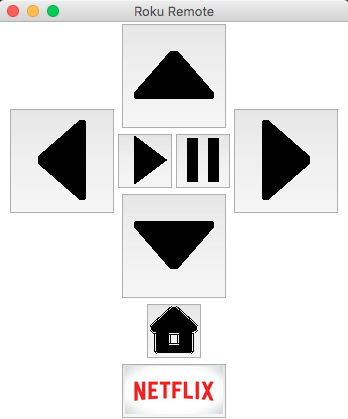

# Roku Remote
A Roku remote made using [Python Roku](https://github.com/jcarbaugh/python-roku).

# Usage
Change the IP address listed on line 11 `roku = Roku('192.168.1.1')` to the IP address of your Roku. 

Run `python rokuRemote.py` to launch the remote

# Screenshot

